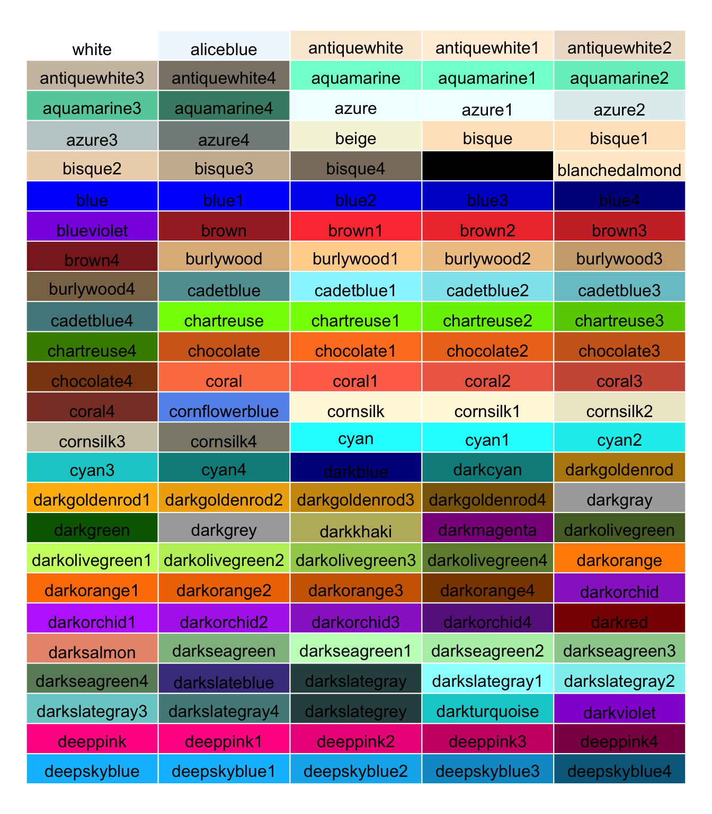
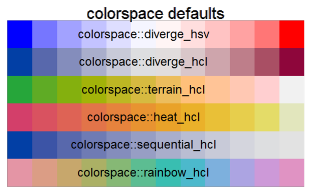
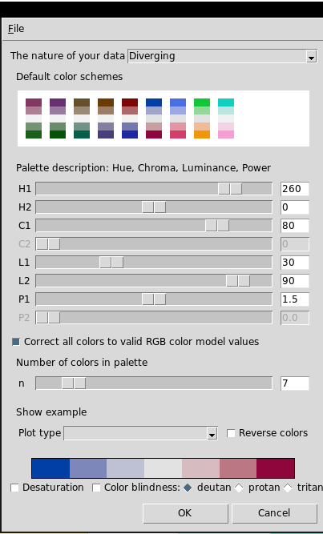

## About colours in R
Selecting colouraesthetically is more than just aesthetics.  Colours are a way to display information, so it pays to think a little about colour palettes and what do they convey.

In R, individual colours usually are represented by the RGB (red-green-blue) model using hexadecimal numbers.
  - #rrggbbtt = red, green, blue, trasparency (optional)
  - E.g.: #FF0000 = red, #000000 = black

Colours can also be translated using the HSV (hue, saturation, value), which is a simple transformation of the RGB model, and the HCL (hue, chroma, luminance) model,  which many people consider that they better capture how the human eye "sees" colors.

In addition, R has 657 built-in color names.  Some of these are shown here:

```{r out.width = "50%", echo= FALSE}

```
For a full list, use the function *colors()*.

To get the rgb value of a particular color do this:
```{r }
col2rgb("purple3")

```

## Palettes
Very often we don't want to select colors "by hand", but instead we want to use a sequence of colours (i.e. a palette).

You should think about your data and choose your palette:
  - Divergent
  - Gradient / sequential
  - Categorical / qualitative

Base R (in the **grDevices** library) has some palettes:

```{r }
heat.colors(4)

topo.colors(4)

```

#### colorspace
The **colorspace** package implements palettes using the HCL and HSV color models.  It has a series of pre-defined palettes:

```{r out.width = "50%", echo= FALSE}

```

**colorspace** has an interactive GUI that can be used to select a palette.

```{r out.width = "50%", echo= FALSE}

```

```{r }
library(colorspace)
pal <- choose_palette()

# This returns a function that can be used to select colors,

pal(5)

```

#### RcolorBrewer
The package *RcolorBrewer* implements the color palettes that can be seen here: http://colorbrewer2.org

```{r }
library(RColorBrewer)
display.brewer.all()

```
Note that we get sequential, qualitative and diverging palettes.

```{r }
mypal <- brewer.pal(n = 5, name = "OrRd")

mypal

```


