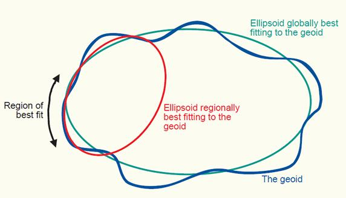
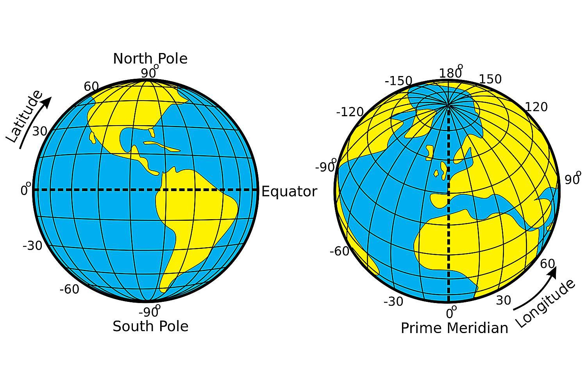
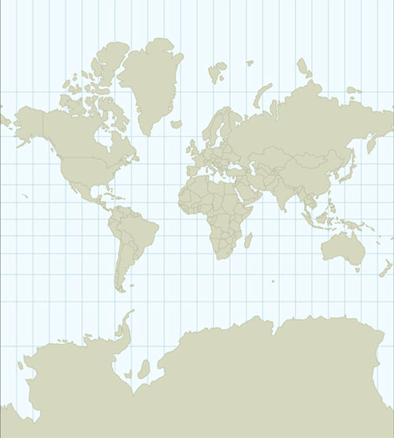
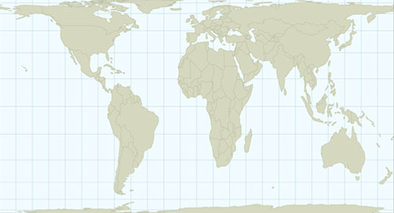
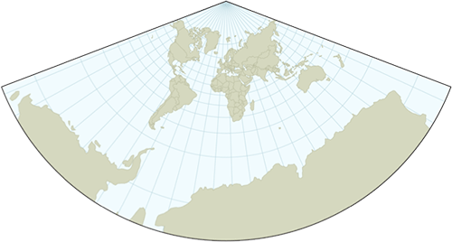

```{r setup, include=FALSE}
knitr::opts_chunk$set(echo = TRUE)
```
# Coordinate Reference Systems (CRSs)
A fundamental aspect of spatial data is defining its Coordinate Reference System (CRS).  Briefly, a CRS defines how to represent the Earth's surface on the plane. Until we define a projection, coordinates are just numbers.

A CRS is a combination of an *ellipsoid*, a *datum*, and a *projection*.

## Ellipsoid
In reality, Earth has a irregular shape.  An ellipsoid is a 3D simplified model that approximates the shape of the Earth.

Some ellipsoids are global, i.e. they try to model the entire globe.  Among these, WGS84 is the most recent and more widely used global reference system. GRS80 is also widely used.

But global ellipsoids have larger errors than ellipsoids fitted locally.  Local ellipsoids are used when higher precision is needed.  Examples: ED50 (Europe), OSGB36 (United Kingdom).

```{r out.width = "50%", echo= FALSE}

```

## Datum
The datum provides the information needed to "anchor" coordinates to the surface of the Earth.  Defines the origin point and the direction of the coordinate axes.

The datum always specifies the ellipsoid, and sometimes have the same name.

## Projection
Finally, the projection indicates how we represent locations on the surface of the earth.  Basically we have two options:

a) Use latitude and longitude, spherical coordinates that represent locations on a 3D globe defined by the datum and ellipsoid used.  But remember:
 - A set of latitude and longitude values can indicate different places when using different datums/ellipsoids.  Differences can be important depending on the application.
 - When we plot latitude/longitude values into a flat surface (like a computer screen or a piece of paper) there is an *implicit* transformation where we take them as Cartesian coordinates (x=longitude, y=latitude).  This is the Equidistant Cylindrical projection.
- When we do not know the datum/ellipsoid, it is usually safe to assume it is WGS84.  In particular for large scale mapping, when the differences among datums are not noticeable.


```{r out.width = "70%", echo= FALSE}

```

b) Use an *explicit* transformation to project spherical coordinates into planar coordinates.  These transformations are known as *spatial projections*.

# Spatial projections

Different combinations of ellipsoid, datum and transformation result in *many* different spatial projections.  They can be classified as planar, conical or cylindrical.

```{r out.width = "50%", echo= FALSE}
knitr::include_graphics("./img/projections.jpg")
```
All map projections introduce distortions in area, shape or distance.  These properties are mutually exclusive: a map projection that preserves one will distort the other two.

For example, the *Mercator* projection is well-know for preserving shapes and exaggerating the area of objects near the poles.  South America in, in reality, much larger than Greenland.  In the Mercator projection, the loxodromes (or rhumb lines) are straight lines, so it is good for navigation.

```{r out.width = "50%", echo= FALSE}

```

On the other hands, the Azimuthal Equidistant projection does not preserve shapes (can you see Australia?).  But it preserves distances to and from the center of the projection (it is an equidistant projection).

```{r out.width = "50%", echo= FALSE}
knitr::include_graphics("./img/proj2.png")
```

The Cylindrical Equal Area is an example of a projection that does not distort the areas (i.e is an equal area projection).  Here the proportion between the areas of Greenland and South America is right... although the shapes are distorted near the poles.

```{r out.width = "50%", echo= FALSE}

```

Conformal projections preserve local shapes.

```{r out.width = "50%", echo= FALSE}

```

## Which projection to use?
- Do not simply ignore CRSs.  Select an appropriate projection for your map/project.
- Projections are not wrong nor right.  They simply have different properties and are used for different purposes.
- For densities (points per grid cell), use equal-area projections.  For example, use the Lambert azimuthal equal-area (LAEA) with center in your study area (select the lon_0 and lat_0 parameteres).  LAEA maintains the area of the objects, but distorts the shape away from the center.
- Azimuthal equidistant (AEQD) projections if you need accurate straight-line distance between a point and the center point of the local projection.
- Lambert conformal conic (LCC) projections are useful for large areas (1000's km).  They preserve the shape of objects, so they are good for general mapping.
- Stereographic (STERE) projections for polar regions, but area and distances get distorted away from the centre.
- Many countries have "official" coordinate system.  For example, Iceland's ISN2004 uses a LAEA projection, centered in Iceland, and the GRS1980 ellipsoid.
- Use a projected CRS when doing geometric operations (polygon overlays, etc.), as the algorithms assume planar coordinates.
- http://spatialreference.org/ lists many, many projections
- http://projectionwizard.org/ and  http://www.radicalcartography.net/index.html?projectionref may be useful to select a projection.

... or select one based on your personality: https://imgs.xkcd.com/comics/map_projections.png

# CRS in R
The *sf* package links directly to the external library PROJ, a very complete cartographic projection library (http://trac.osgeo.org/proj/).  In the PROJ library, projections are defined using projstring, a text string defining the projection, datum and associated parameters.  Here are some examples:

For unprojected (geographical) data: +proj=longlat +datum=WGS84

For data in the UTM projection, zone 28: +proj=utm +zone=28 +datum=WGS84

For a Lamberts Equal Area projection centred in the Nordic Seas:  +proj=laea +lat_0=69 +lon_0=-4 +datum=WGS84

Many common projections are included in the European Petroleum Survey Group (EPSG) database (http://www.epsg.org/), and can be specified only by using a reference number.  For example, the EPSG code 4326 indicates urprojected data, so it is equivalent to the projstring "+proj=longlat +datum=WGS84".


When we read a spatial object into, if the projection is included in the metadata then the projection will be included in the object.  We can use the *st_crs()* function to extract it.

```{r }
library(rnaturalearth)
library(tidyverse)
library(sf)

iceland <- ne_countries(returnclass = "sf", country = "Iceland", scale = 10) %>%
  st_geometry()

st_crs(iceland) # Find out the CRS

```

If the metadata does not includes the CRS, or if we create our own sf object, the CRS will not be defined.

```{r }
mysf <- data.frame(lat = c(66,65.5), lon = c(-20, -19)) %>%
  st_as_sf(coords = c("lon", "lat"))

st_crs(mysf)

```

We can define it with *st_crs* (or with *st_set_crs* if we use it in a pipe)

```{r }
mysf <- data.frame(lat = c(66,65.5), lon = c(-20, -19)) %>%
  st_as_sf(coords = c("lon", "lat")) %>%
  st_set_crs(4326)

st_crs(mysf)

```

If I change the CRS of an object that already has it, I get a warning:

```{r }
st_set_crs(mysf, 5325)

```
Essentially, if we want to *transform* spatial data from one projection to another we need to use the *st_transform()* function.

```{r }
st_crs(iceland)

plot(iceland, axes = TRUE)

iceland_laea <- iceland %>% st_transform("+proj=laea +lat_0=69 +lon_0=-4 +datum=WGS84")

plot(iceland_laea, axes = TRUE)

```
