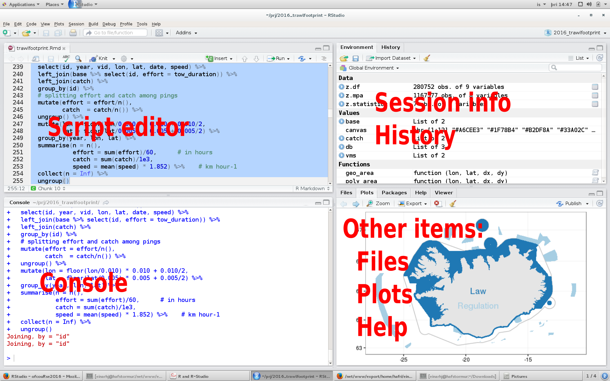

```{r setup, include=FALSE}
knitr::opts_chunk$set(echo = FALSE, message = FALSE, warning = FALSE)
```

## Preamble
___

### The announcement

[THE CALL](http://www.ices.dk/news-and-events/Training/Pages/R.aspx)

### The course material

The course material is open source, meaning that the source code is made freely available and may be redistributed and modified.

* The source code for the course material is located at: https://github.com/fishvice/spatialr
* The course product is rendered at: http://www.hafro.is/~einarhj/spatialr

### Typical science project

```{r out.width = "75%", fig.cap = "From: Grolemund and Wickham"}
knitr::include_graphics("img/data_science.png")
```

* Import
    * Import data stored in a file, database, or web API, and load it into R
* Tidy
    * Each column is a variable, and each row is an observation
* Transform
    * Narrowing in on observations of interest
    * Creating new variables that are functions of existing variables
    * Calculating a set of summary statistics (like counts or means)
    * ...
* Visualize
    * May show unexpected things
    * May raise new questions about the data
    * A powerful communication platform
    * ...
* Model
    * Once questions made sufficiently precise, one can use a model to answer them
    * Model cannot question its "own" assumptions!
* Communicate
    * Presentation and documentation

This short course will primarily focus on **transforming** and **visualizing** **spatial** data. Other elements mentioned above will though be touch upon, albeit in less details.

We are, where possible, going to use a set of recently developed tools that fall under the **tidyverse** and **sf** umbrella. These are basic set of **generic** tools that are integrated to work seamlessly with one another.

## Getting started
___

For this course you need to have R (and Rtools), RStudio and a sweep of packages.

### R

#### What is R?

* R is command line driven programming language
    * its biggest appeal is one can **reuse** commands
    * its biggest hurdle in widespread use
* R is open-source:
    * Other statistical software packages can be extremely expensive
    * Large user base with almost all statistical methods implemented

#### Why R?

R has become the *lingua franca* of statistical analysis and data wrangling

* Its free! If you are a teacher, a student or a user, the benefits are obvious
* It runs on a variety of platforms including Windows, Unix and MacOS
* It provides an unparalleled platform for programming new statistical
methods in an easy and straightforward manner
* It offers powerful tools for data exploration and presentation
* Encompasses reproducible workflow

#### Download R

* Latest version of __R__: see [The Comprehensive R Archive Network](https://cran.r-project.org/)
    * If your platform is Windows, also install [Rtools](https://cran.r-project.org/bin/windows/Rtools)
   * If your platform is Mac, install **XCode** via AppStore.

### RStudio

#### What is RStudio?

* [RStudio](https://www.rstudio.com) allows the user to run R in a user-friendly IDE environment.
* It is open-source (i.e. free) and available at www.rstudio.com
* Built to help you write R code, run R code, and analyze data with R
* Text editor, project handling, markdown support, keyboard shortcuts, debugging tools, version control, ...

* Within RStudio one can achieve almost all that is needed to complete a typical science project

#### Download RStudio

* Latest version of __RStudio__: see [RStudio Desktop](https://www.rstudio.com/products/rstudio/download/)
    * If you are adventurous install the latest [developmental version](https://www.rstudio.com/products/rstudio/download/preview)

### Running R

#### Our environment - RStudio

A typical RStudio window may look something like this:
```{r out.width = "75%"}

```

* **Console**: One can type R commands directly into the console to perform calculations
* **Script editor**: An R script is basically a series of stored R commands that can be run in the
console
    * To generate a new script do: New file -> R Script (ctrl-shift-N)
* **Environment**: Contains a list of all declared variables. If you have a dataset you can double click the variable to view the data.
* **History** Contains a list of previous commands entered into the console
* **Other items**:
    * Files: List of object in a directory
    * Plots: Graphical output from R. The user can export these the figures to file (as jpeg, png or pdf) or to clipboard
    * Help: Gives a brows-able interface to R’s in-line help pages. The user can search for a topic or a specific function
    
#### RStudio project

* RStudio allows us to make things a little bit easier by isolating various tasks within specific projects (**read**: directory/folder on your computer).
* Projects save the state between sessions. This includes:
    * Working directories
    * Open files/scripts
    * Workspaces (.RData file - do not save this)
* One can have multiple RStudio projects open at any one time
    * The modern call for multitasking :-)
    
We strongly urge you to get into the habit of splitting your various tasks into specific RStudio projects.

A typical directory structure of a project (here called dummy) may be something like:

```
einarhj/edu/spatialr/dummy                   # project directory
├── data                                     # tidy data as R binary files
│   └── is_smb_stations.rds
├── data-raw                                 # raw data, often untidy
│   └── is_smb_stations.csv
├── dummy.Rproj                              # RStudio file
├── R                                        # Directory containing scripts
│   └── addition.R
└── survey_explorations.Rmd                  # A markdown report template

```


<div class="panel panel-warning">
<div class="panel-heading">Hands on exercise - Projects and some basic R</div>
<div class="panel-body">

1. Open R-studio and create a new project: File -> New project ... -> New directory --> Empty project --> ...
2. Create a new R script: File -> New file -> R Script
3. Copy the content of [this code](http://www.hafro.is/~einarhj/tcrenv/R/exercise1.R) into the R script.
3. Save the script, e.g. exercise1.R: File -> Save
4. Run each line of code, observe, change, add, and most importantly learn while doing (this is just a refresher of some elementary base R operations).
5. Once you have gone through the whole script, try: File -> Compile Report ..., choosing the output according to your liking :-)

</div>
</div>

## Packages
___

### What are packages?

* Packages are a collection of functions and data with documentations.
* Numerous basic packages come with R but the strength of the R-environment comes from the huge amount of packages that are provided by third sources.

```{r out.width="75%"}
url <- "https://gist.githubusercontent.com/daroczig/3cf06d6db4be2bbe3368/raw/8e970fad675d443813be2c98c508e6224491495e/number-of-submitted-packages-to-CRAN.png"
knitr::include_graphics(url)
```

### Installing packages

If you have not already done so, or it is a long time since you have done so, run the following:

```{r cran-installation, eval = FALSE, echo = TRUE}
install.packages("tidyverse")
```

This will install among other things the __core__ tidyverse packages:

* [ggplot2](http://ggplot2.tidyverse.org), for data visualization.
* [dplyr](http://dplyr.tidyverse.org), for data manipulation.
* [tidyr](http://tidyr.tidyverse.org), for data tidying.
* [readr](http://readr.tidyverse.org), for data import.
* [purrr](http://purrr.tidyverse.org), for functional programming.
* [tibble](http://tibble.tidyverse.org), for "tibbles", a modern re-imagining of data frames.
* [stringr](http://stringr.tidyverse.org), for strings
* [forcats](http://forcats.tidyverse.org), for factors

`library(tidyverse)` will load the core tidyverse packages.

In addition, this also installs a selection of other tidyverse packages that you're likely to use frequently, but probably not in every analysis. This includes packages for:

* Working with specific types of vectors:
    
    * [lubridate](http://lubridate.tidyverse.org), for date/times.

* Importing other types of data:

    * DBI, for databases (..., this may create a problem)
    * haven, for SPSS, SAS and Stata files.
    * httr, for web apis.
    * [jsonlite](https://github.com/jeroenooms/jsonlite) for JSON.
    * readxl, for `.xls` and `.xlsx` files.
    * rvest, for web scraping.
    * xml2, for XML.

* Modelling

    * modelr, for modelling within a pipeline
    * [broom](https://github.com/dgrtwo/broom), for turning models into 
      tidy data

These packages you'll load explicitly with `library()`.

Additional packages (there will be plenty) we will install as we progress through the course.

