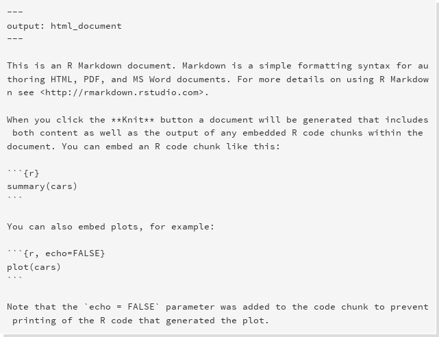

```{r, echo = FALSE}
knitr::opts_chunk$set(warning = FALSE, message = FALSE)
```

# Preamble
___

Packages used:
```{r}
library(tidyverse)
library(rmarkdown)
library(knitr)
```


# Reproducible research
___

Reproducible research focuses on answering the following questions:

* How did you do that?
* What data did you use?
* Where is code used?

Essentially one wants to capture the typical workflow of:

* Preparing data
* Analyzing the data
* Report on the findings
* Then realizing that you did something wrong
* Do it all over again


"The final product of research is not only the paper itself, but also the full computation environment used to produce the results in the paper such as the code and data necessary for reproduction of the results and building upon the research." (Xie, 2014).


# Rmarkdown
___

A convenient tool to generate reproducible document. A R Markdown document is written in markdown (an easy-to-write plain text format) and contains chunks of embedded R code. This is a Rmarkdown document:


Notice that the file contains three types of content:

* An (optional) YAML header surrounded by `---`s
* R code chunks surrounded by ` ``` `s
* text mixed with simple text formatting

To generate a report from the file, run the render command:
```{r,eval=FALSE}
library(rmarkdown)
render("file.Rmd")
```

Better still, use the “Knit” button in the RStudio IDE to render the file and preview the output with a single click or keyboard shortcut ([ctrl/cmd]+[shift]+K). 

Rmarkdown documents can out of the box be rendered as:

* Html documents (webpages)
* Word documents
* PDF document


<div class="panel panel-warning">
<div class="panel-heading">Exercise</div>
<div class="panel-body">
In Rstudio create a new markdown file, play around with different rendering options 

</div>
</div>

# Working with Markdown
___

Markdown is designed to be easy to write, and, even more importantly, easy to read:

>  A Markdown-formatted document should be publishable as-is, as plain text, without looking like it’s been marked up with tags or formatting instructions. – John Gruber

Markdown does therefore only provides light text formating commands leaving the page layout to the renderer. 

### Paragraph formating

When writing paragraphs you have the options of creating italicised text with encapsulating text with `*`. This means that is `*some text*` is rendered as *some text*. Simliarly bold text is indicated by encapsulating the text with `**`.  Super and subsctripts are indicated with `a^2^` (a^2^) and `b~2~` (b~2~) respectively.

Horizontal rulers are created using either of the following:

~~~
***
___
~~~~

which generates this

***

### Lists

Bulleted and numbered lists are created using single `*` so this bit of code:

~~~  
* Bla bla bla
* ble ble ble
~~~

becomes:

* Bla bla bla
* ble ble ble

You can create subitems in a list using:

~~~
* Bla bla bla
    * indented list item
* ble ble ble
~~~

which becomes

* Bla bla bla
    * indented list item
* ble ble ble
    
Numbered lists are simply generated with

~~~
1. bla bla bla
2. ble ble ble
~~~

which becomes 

1. bla bla bla
2. ble ble ble

### Headings

Section heading are created with `#` followed with the section title. Subsections and subsubsections (and subsubsub...) are created similarly with `##` and `###` etc. So the following bits of text:

~~~
# Heading 
## Subheading 
### Subsubheading 
#### Subsubsubheading
~~~

is rendered as

# Heading 
## Subheading 
### Subsubheading 
#### Subsubsubheading

### Tables

Tables in Markdown are fairly easily generated using the following code:
```
First Header  | Second Header
------------- | -------------
Content Cell  | Content Cell
Content Cell  | Content Ce
```
which results in:

First Header  | Second Header
------------- | -------------
Content Cell  | Content Cell
Content Cell  | Content Cell

### Images

Figures can be embedded into markdown using the the following command:
```

```

### Mathematical

Mathematical formulas can also be rendered via the LaTeX equation environment, indicated by some commands enclosed by `$`-signs (`$$` to present the formula centered in a new line). So as a simple example the following bit of text:
```
$x^2 + \sum_i a_i y_i^n$
```
becomes
$$x^2 + \sum_i a_i y_i^n$$

which renders as word equation when exported to a word file.


<div class="panel panel-warning">
<div class="panel-heading">Exercise</div>
<div class="panel-body">
In your markdown file investigate how various formating settings will appear in a word file. As an example:

* Create a header and sub-headings
* Create a dummy table 
* Create a bulleted list
* Embed a figure into the document

</div>
</div>


# Embedding R

One of the key things with Rmarkdown is the ability to embed R code with the document writing


R code is weaved into the document in using specialised input environments, called **chunks**:

~~~
# ```{r}
#  #<insert R code for Markdown>
# ```
~~~

In these chunks you can place any type of R command which will be run whenever the document is rendered. The code chunks rememeber the results from previous chunks in the document, so the Rmarkdown file behaves like a regular R-script. Code chunks can be created either by selecting "Insert chunk" from the "Code" menu in Rstudio or by using the keyboard shortcut [ctrl] + [alt] + I. By default chunks are rendered such that both the code in the chunk is visible and the output, which is either a figure or printout from the console. So 

~~~
# ```{r}
#  x <- 1
#  x
# ```
~~~

will be rendered as:
```{r}
x <- 1
x
```


How the code is rendered is can be controlled to fairly fine detail with chunk options. These are set within the curly braces at the start of the chunk. For instance if you only want the output from the calculation but hide the code you change the `echo` setting to `FALSE`:

~~~
# ```{r,echo=FALSE}
#  x <- 1
#  x
# ```
~~~
which becomes:
```{r,echo=FALSE}
x <- 1
x
```

Figures are rendered in place:

```{r}
plot(1:9)
```

and you can control the figure width and height using the `fig.width` and `fig.height` options. So this chunk:

~~~
# ```{r,fig.height=6,fig.width=3,echo=FALSE}
# plot(1:9)
# ```
~~~

results in this:

```{r,fig.height=6,fig.width=3,echo=FALSE}
plot(1:9)
```


In additions to the options chunks have a plethora of other options available to further control the output:

Options | Description
------------- | ----------------------------------------------------------------
`eval = TRUE` | Evaluate all or part of the current chunk
`echo = TRUE` | Show all or part of the source code
`message = TRUE`  | Show all messages from the console
`warning = TRUE`  | Show all warnings 
`results = 'asis'`  | Writes raw output from R to the output document without markup. Helpful for creating tables with xtable. markup is the default.
`include = TRUE`  | Code chunk will be included in output. If you don't want a chunk in the output but still evaluated set this to FALSE
`fig.width = 8` | controls the figure width (in inches)
`fig.height = 4`  | controls the figure height (in inches)
`fig.cap = 'Figure caption'`  | is the figure caption, note captions are only rendered when captions are enabled. 
`fig.align = [ht]`  | Sets the figure alignment in pdf output
`dev` | allows the user to specify the file type of the plot (png, pdf, bmp, etc..)
`cache = FALSE` | Should the calculations in this chunk be cached, very useful for heavy calculations  


Tables can can also be generated from code chunks. The `kable` function from the `knitr` package can take any data frame an turn it into a table. Thes following chunk will produce a table from the `tab` data frame. Note the `results = 'asis'`.

~~~
# ```{r,echo=FALSE,results='asis'}
# tab <- tibble(x=1:3,a=letters[x])
# kable(tab,caption = 'This is a table caption')
# ```
~~~

This will become:

```{r,echo=FALSE,results='asis'}
tab <- tibble(x=1:3,a=letters[x])
kable(tab,caption = 'This is a table caption')
```


<div class="panel panel-warning">
<div class="panel-heading">Exercise</div>
<div class="panel-body">
In your markdown file:

* Create a code chunk that reads in the minke whale dataset
* Create another chunk that plots the length weight relationship with the appropriate figure caption
* Create table illustrating the number of males and females by year

</div>
</div>

# The YAML header

The YAML (**Y**et **A**nother **M**arkup **L**anguage) header is the top part of the Rmarkdown document.  R Markdown uses it to control many details of the output, such as the title and author. Many of the settings in YAML can be set using the options menu in Rstudio. The following table shows a couple of the most commonly set YAML options:

Option  | Description
--------------- | --------------------------------------------------------------
*author*  | The document author
*date*  | Date of the document
*title* | Title of the document
*output*  | Can be *html_document*, *pdf_document*, *word_document*
*fig_width* and *fig_height* | Default figure width, can be overridden with chunk options

However there are two useful additional settings in the YAML header that cannot be set with menu options, bibliographic citations and word style templates.

### Bibliography

Bibliographic references can be added to a markdown file quite easily. To use this feature you need to set the `bibliography` field in the YAML header and this setting should point to the location of the references.  The references are read from a BibTeX-file, a special file format for bibligraphic citations. A typical BibTeX file looks something like this:

~~~
@book{darwin2009origin,
  title={The origin of species by means of natural selection: or, the preservation of favored races in the struggle for life},
  author={Darwin, Charles and Bynum, William F},
  year={2009},
  publisher={AL Burt}
}

@article{pope2009honey,
  title={Honey, I cooled the cods: Modelling the effect of temperature on the structure of Boreal/Arctic fish ecosystems},
  author={Pope, John G and Falk-Pedersen, Jannike and Jennings, Simon and Rice, Jake C and Gislason, Henrik and Daan, Niels},
  journal={Deep Sea Research Part II: Topical Studies in Oceanography},
  volume={56},
  number={21},
  pages={2097--2107},
  year={2009},
  publisher={Elsevier}
}

~~~


and the YAML header referencing the bibliography could look something like:

~~~
---
title: "Example"
output:
  html_document
bibliography: example.bib
---
~~~

You can the cite the relevant entries from BibTex file using the `@shortname`, which gives you an inline reference or `[@shortname]` to cite within parenthesis (or `[@short1; @short2]` to cite more than one). So if you want to cite Darwins origin orign of the species do @darwin2009origin which will result in @darwin2009origin, and within parenthesis `[@darwin2009origin; @pope2009honey]` or [@darwin2009origin; @pope2009honey].

### Word style templates

If you want the appearance of your word document to mimic another word document you can use the `reference_docx` option in the YAML header:

~~~
---
title: "Test"
output:
  word_document: 
    reference_docx: tmp.docx
---
~~~

<div class="panel panel-warning">
<div class="panel-heading">Exercise</div>
<div class="panel-body">
In your markdown file:

* Add bibliography to your file
* Download an ICES word document from the [hafro ftp site](ftp://ftp.hafro.is/pub/tcrenv) and use as a template for the resulting word document
</div>
</div>

# Addendums

### Hidden text

```
<!-- This text I do not want to show -->
```

<!-- This text I do not want to show -->

### LaTeX Math Symbols

See e.g. http://web.ift.uib.no/Teori/KURS/WRK/TeX/symALL.html

### Automatic date in header:

```{r eval = FALSE}
 author: "bla blason"
 date: "`r format(Sys.time(), '%d %B, %Y')`"
 output: html_document
```

# References

