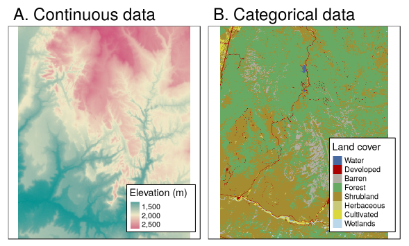
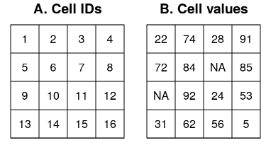

```{r, include=FALSE}
knitr::opts_chunk$set(echo = TRUE)
```

# Getting started
___

**Packages needed for this tutorial**:
```{r setup}
library(tidyverse)   # installs sweeps of packages
library(sf)          # working with sf objects in R
library(raster)      # working with rasters in R
library(rgdal)       # links to the GDAL library
library(rasterVis)   # raster visualization
library(marmap)      # access global topography data

```

**Loading external data**
We will load two rasters with near-bottom temperatures in Icelandic waters.  These were compiled using data from NISE (Norwegian Iceland Seas Experiment) project.  Note how we use the function *raster()* to load a raster file (in this case in format GeoTIFF).

```{r}
# Minimum temperature
mintemp <- raster("ftp://ftp.hafro.is/pub/data/rasters/Iceland_minbtemp.tif")

# Maximum temperature
maxtemp <- raster("ftp://ftp.hafro.is/pub/data/rasters/Iceland_maxbtemp.tif")

# And a bit of data off the Faroe Islands
far_temp <- raster("ftp://ftp.hafro.is/pub/data/rasters/Faroes_minbtemp.tif")

```

Near-bottom current speed from
Bio-ORACLE (http://www.bio-oracle.org/) using the **sdmpredictors** package.

```{r }
# Near-bottom current speeds
current_sp <- raster("ftp://ftp.hafro.is/pub/data/rasters/Iceland_currentsp.tif")

```
Here we use the *getNOAA.bathy* function to download bottom depth data from NOAA's ETOPO1 database.

```{r }
xlim <- c(-28, -10)
ylim <- c(62.5, 67.5)

dir.create("./data_raw") # Where the data will be saved
setwd("./data_raw")

depth <-
  getNOAA.bathy(lon1 = xlim[1], lon2 = xlim[2],
                lat1 = ylim[1], lat2 = ylim[2],
                resolution = 1, keep=TRUE) %>% # Write the data into your hard drive
  as.raster() # Convert to a raster object
setwd ("../")

depth[depth > 0] <- NA # Ignore land

```

## Raster data model

Raster data is used to represent parameters that vary continuously in space.

A raster represents some area as a regular grid of equally sized rectangles, known as cells or pixels.

Each cell can hold one or more data values (i.e. single-layer and multi-layer rasters).  Data can be continuous (e.g. depth, temperature) or discrete/categorical (e.g. land types). Satellite images are rasters.  Rasters are also used to store the output of interpolations and of oceanographic models.

<center>
{width=50%}
</center>


Each cell has an individual ID. To define a raster you need to define:
  - The cell size (also known as grain or resolution)
  - The extent (raster size) or number of cells
  - The origin (the lowes x and y values)
  - The coordinate reference system

<center>
{width=50%}
</center>

Some raster formats can have multiple bands (layers).

## Rasters classes in R
There main package to read and manipulate rasters is the **raster** package, which provides three classes:

  - **RasterLayer** for single variable datasets
  - **RasterBrick** for multiband data in a single file (e.g. multispectral satellite data)
  - **RasterStack** for multi-variable datasets originating from multiple files.

## Reading rasters into R

There are many different formats for raster data.  The **raster** packages uses the external library **GDAL** to read them.  You can get the list of all possible formats here:

- http://www.gdal.org/formats_list.html

TIFF or geoTIFF (.tif or .tiff) and ASCII grid (.asc) are two of the most common formats.

Reading rasters using the **raster** package is easy.  Just use the *raster()* function.  Let's try it with a raster with bottom temperature around Iceland.

```{r}
temps <- stack(mintemp, maxtemp) # A rasterstack

class(mintemp)
nlayers(mintemp)

class(temps)
nlayers(temps)
names(temps)

# I can pass a vector with paths to files

files <- c("ftp://ftp.hafro.is/pub/data/rasters/Iceland_minbtemp.tif",
           "ftp://ftp.hafro.is/pub/data/rasters/Iceland_maxbtemp.tif")

temps <- stack(files)

```
We can do a quick plot using R's base graphs.

```{r}
plot(mintemp)

plot(temps)

```

## Raster metadata
If we print the raster we can see the metadata, including the dimension, resolution, extent, coordinate reference system, location, and range of values.

We can use the *GDALinfo()* function in the **rgdal** package to extract the metadata.

```{r }
capture.output(GDALinfo("ftp://ftp.hafro.is/pub/data/rasters/Iceland_minbtemp.tif"))

```

The coordinate reference system can be extracted (and set) with the **crs()** function.

```{r }

crs(mintemp)

```

The *extent()* function provides an object of class *extent*. with the ranges of the horizontal and vertical coordinates.

```{r }
extent(mintemp) # An object of class extent

bbox(mintemp) # A matrix

```

## Summary statistics
The function *cellStats()* computes summary statistics of a *raster* object.

```{r }
cellStats(mintemp, mean)
cellStats(temps, mean)

summary(mintemp)

# Some functions just work with rasters
hist(mintemp)

#... but more often we will need to extract the raster values before applying a function to them.

```


## Rasters with categorical (factor) data
Raster objects can store logical, integer, continuous or categorical data.

Rasters with categorical data contain a "raster attribute table" or RAT.  The values in raster cells are integers that act as an index to the actual values in the RAT.

```{r }
# Create classification matrix

cm <- matrix(c(
  -2, 2, 1,
  2, 4, 2,
  4, 10, 3),
  ncol = 3, byrow = TRUE)

# Create a raster with integers
temp_reclass <- reclassify(mintemp, cm)

is.factor(temp_reclass)

plot(temp_reclass)

# Make a factor raster
temp_factor <- as.factor(temp_reclass)  # Same as ratify(temp_reclass)
is.factor(temp_factor)

rat <- levels(temp_factor)[[1]] # Extract the RAT
rat$category <- c("cold", "mild", "warm") # Add levels
levels(temp_factor) <- rat

plot(temp_factor)

```
When we use base graphs, categorical rasters are plotted just like contiguous rasters.  The RAT is not used for the legend.  We need to do it "by hand":

```{r }
plot(temp_factor, legend = FALSE,
     col = c("blue", "lightblue", "red"))

legend(x = "right", legend = levels(temp_factor)[[1]]$category,
       fill = c("blue", "lightblue", "red"))

```

Or we can use the **rasterVis** package which provides the *levelplot()* function:

```{r }
rasterVis::levelplot(temp_factor,
                     col.regions = c("blue", "lightblue", "red"))

```

**rasterVis** can make different types of plots using raster data.  It is based on the lattice system of graphics, which has its own syntax and idiosyncrasy.


## Manipulation of raster objects
#### Extracting values from a raster
To extract values from a *raster* object, we use the bracket ([) operator or the *extract()* function.  Beware that there is also an *extract()* function in the tidyverse.  This is a common source of conflict when **raster** and the tidyverse are used at the same time.

```{r }
mintemp[239] # Cell ID=239
# ID=1 at the top left.

mintemp[20, 50] # Row 20, column 50

# Same as...
cell <- cellFromRowCol(mintemp, 20, 50)
cell
mintemp[cell]


mintemp[20:25, 50:55] # Rows 20 to 25, columns 50 to 55

# Same as...
cells <- cellFromRowColCombine(mintemp,
                               20:25, 50:55)
mintemp[cells]


# So far we have received vectors with cell values.

rst <- mintemp[20:25, 50:55, drop = FALSE] # Returns a new raster!
plot(rst)

# We can also extract from a raster using an extent object
ext <- extent(c(-944011, -784505, -278260, -160260))

par(mfrow = c(1, 2))
plot(mintemp)
plot(ext, add = TRUE)

rst <- mintemp[ext, drop = FALSE]
plot(rst)

```

#### Replacing values
In the same way that we do extractions, we can replace the values of cells with new values.

```{r }
par(mfrow = c(1, 2))

rst <- mintemp[20:25, 50:55, drop = FALSE]
plot(rst)

rst[4, 2] <- rst[4, 2] + 30
rst[1:2] <- rst[1:2] + 10
plot(rst)

```

#### Masks

We can mask a raster with another raster with the same geometry.  Cells with NA values in the mask are removed from the masked raster.

```{r }

rst <- mintemp[100:135, 50:85, drop = FALSE]

# Create an empty raster with the same geometry
my.mask <- raster(rst)
my.mask[] <- 1 # Put some non-NA value

set.seed(100)
cells <- sample(1:ncell(my.mask), 20)
my.mask[cells] <- NA

rst_masked <- mask(rst, my.mask)

par(mfrow = c(1, 2))
plot(rst)
plot(rst_masked)

# Same as...

rst_masked <- rst
rst_masked[cells] <- NA

```

#### Extracting raster data with sf objects

```{r }
bt_points <- read_sf("ftp://ftp.hafro.is/pub/data/shapes/ice_points.gpkg")
bt_lines <- read_sf("ftp://ftp.hafro.is/pub/data/shapes/ice_lines.gpkg")
bt_poly <- read_sf("ftp://ftp.hafro.is/pub/data/shapes/ice_polygon.gpkg")

plot(mintemp)
plot(bt_points, add = TRUE)
plot(bt_lines, add = TRUE)
plot(bt_poly, add = TRUE)

```
We can use objects of class *sf* to extract values from rasters.

- For a POINT geometry, we get the values of the cells where the points are located (unless *method="bilinear"*).
- For a LINESTRING geometry, we get the values of the cells touched by the line.
- For a POLYGON geometry, we get the values from the cells that their centroids are located within the polygon.

```{r }

ex1 <- raster::extract(mintemp, bt_points) # A vector
ex2 <- raster::extract(mintemp, bt_lines) # A list (one element for each line)
ex3 <- raster::extract(mintemp, bt_poly) # A list (one element for each polygon)

ex3 <- raster::extract(mintemp, bt_poly,
                       df = TRUE, cellnumbers = TRUE) # A data frame with cell numbers

```

We can also use an *sf* object as a cookie cutter to mask a raster.  Make sure that they share the same CRS.  With the argument *inverse = TRUE* we can do an extraction and have a *raster* object as return.


```{r }
plot(mintemp)
plot(bt_poly, add = TRUE)

temp_masked <- mask(mintemp, bt_poly)
temp_masked_inv <- mask(mintemp, bt_poly, inverse = TRUE)

par(mfrow = c(1, 2))
plot(temp_masked)
plot(temp_masked_inv)

```

## Raster algebra

Rasters are a very efficient way to do mathematical operations on spatial data.  This is because the coordinates of cells are not stored explicitly.  When we do a cell-by-cell operation, we can ignore the cell coordinates and treat the data as long vector or a matrix.  And we can do fast operations between two or more rasters if they share the same geometry.


```{r }
tempkelv <- mintemp +  273
tempsq <- mintemp ^ 2
tempdiff <- maxtemp - mintemp

par(mfrow = c(2, 2))
plot(mintemp)
plot(tempkelv)
plot(tempsq)
plot(tempdiff)

```

#### Moving window operations
A moving window operation (also known as kernel) is a computation carried out in each cell but using values of adjacent cells.  The group of adjacent cells used is known as the "window".

Commonly windows are rectangular (often 3x3 cells), but they can have any size or shape.

Let's calculate the variability of bottom depth using two window sizes:

```{r }
# Small scale depth variability in a 3x3 window
depth_var_ss <- focal(depth,
                   w = matrix(1/9,nrow=3),
                   fun = var,
                   na.rm = TRUE)

# Large scale depth variability in a 15x15 window
depth_var_ls <- focal(depth,
                   w = matrix(1/225,nrow=15),
                   fun = var,
                   na.rm = TRUE)

par(mfrow = c(1, 2))
plot(depth_var_ss, zlim = c(0, 1000))
plot(depth_var_ls)

```

## Zonal statistics
Zonal statistics refers to the calculation of statistics on values of a raster within the zones of another raster.  Both rasters need to have the same geometry.

Here we will find out the average current speed in three depth zones defined at 400 and 700m.

```{r }
# Classification matrix
cm <- matrix(c(
  -400, 0, 1,
  -700, -400, 2,
  -2500, -700, 3),
  ncol = 3, byrow = TRUE)

depth_reclass <- reclassify(depth, cm)


# Make sure rasters have the same geometry
compareRaster(depth, current_sp)

# Mean current speed per depth zone
zonal(current_sp,
      depth_reclass, fun = mean)

# Range of current speeds per depth zone
zonal(current_sp,
      depth_reclass, fun = range)

```

## Changing the geometry of a raster
#### Modify the extent and origin
The *extend()* function returns a raster with a larger extent.  The *origin()* function changes the origin of the raster.

```{r }

ex_depth <- extend(depth, c(40, 500), value = -1000)

or_depth <- depth
origin(or_depth) <- c(0, 0)

extent(depth)
extent(or_depth)

```

#### Changing the resolution

The functions *aggregate()* and *dissagregate()* can be used to change the resolution of a raster by splitting or merging cells.

```{r }
res(depth) # Resolution
dim(depth) # Number of cells and layers

agg_depth <- aggregate(depth, fact = 5,
                          fun = mean)

dim (agg_depth)

dis_depth <- disaggregate(depth,
                          fact = 5,
                          method = "bilinear")
dim (dis_depth)

plot(depth)
plot(agg_depth)
plot(dis_depth)

```

#### Cropping
We can crop a raster using an *extent* object or any object from which an *extent* object can be extracted.

```{r }
ext <- extent(c(-25, -20, 63, 65))

crop_depth <- crop(depth, ext)

plot(crop_depth)

```

#### Merging rasters
To merge rasters we have two options.  We can use the *merge()* function, which in the overlapping areas use the values of the first raster.  We can also use the *mosaic()* function which allows for using a function to compute the cell values in overlapping areas.


```{r }
ice_temp <- mintemp + 10

icefar_temp <- merge(ice_temp, far_temp)

plot(icefar_temp)

icefar_temp2 <- mosaic(ice_temp, far_temp, fun = "mean")

plot(icefar_temp2)

```

#### Resampling and projecting rasters
Often we want to change the geometry of a raster to match the geometry of some other raster.  This is needed for example when we want to use data from different sources into a single analysis.

**Resampling** refers to transferring values between rasters with different origin and/or resolution.  If we rasters have different coordinate reference systems (CRS), we are **projecting** the raster.

The **raster** package provides two functions to do this, namely *resample()* and *projecRaster()*.  The main difference is that *projectRaster()* takes a different CRS as an argument.  If the CRS is the same as the CRS of the input raster, then both functions do the same.

```{r }
# Create an target raster "by hand"

target1 <- raster(depth)
origin(target1) <- c(0, 0)
res(target1) <- 0.025

depth_res <- resample(depth, target1)

# In this case, the same as
depth_res <- projectRaster(depth, target1)

# Changing also the CRS
crs(depth)
crs(mintemp)

# Matching only the CRS
depth_proj1 <- projectRaster(depth, crs = crs(mintemp))

# Complete raster alignment
depth_proj2 <- projectRaster(depth, mintemp)

```
In both functions we should use the argument *method="bilinear"* with continuous rasters, or *method="ngh"* for categorical or integer rasters.

*Warning:* Note that when we reproject vector data (like in the case of *sf* objects) we change the coordinates of the objects but we do not change the attribute (data) values.

BUT when we reproject rasters (or we do any change in the raster geometry) we **do** change the data.  This is because the raster grid first is adjusted (by moving the origin, or projecting it to a new CRS), and then the cell values (usually taken at the centre of the cells) are interpolated to the centres of the new raster.

This is a limitation of the data model of the **raster** package, which only deals with regular grids.  The **stars** package has a more flexible data model and allows rasters with rotated, irregular and curvilinear grids.


## Rasterization
Rasterization is the process of converting vector data of some kind into a raster.  How this is done exactly depends on the type of vector data (POINT, LINESTRING, POLYGON) and on the arguments we pass, for example, to the *rasterize()* function.

To do a rasterization we need to select a target raster, which is often another raster dataset to which we want to match our vector data.

A common case is to rasterize a POINT geometry. Note that the arguments *field* and *fun* define which column are we rasterizing (with more than one we get a RasterBrick) and which function we use (the default is "last()").

```{r }
# A raster from scratch
target <- raster(xmn = -28, xmx = -10, ymn = 62.5, ymx = 67.5,
                 res = 0.2, crs = CRS("+proj=longlat +datum=WGS84"))

stations <- read_csv("ftp://ftp.hafro.is/pub/data/csv/is_smb_stations.csv") %>%
  st_as_sf(coords = c("lon1", "lat1"), crs = 4326)


station_rst1 <- rasterize(stations, target, field = "id", fun = "count")

station_rst2 <- rasterize(stations, target, field = c("duration","speed"), fun = "sum")

par(mfrow = c(1, 2))
plot(station_rst1, main = "Number of stations")
plot(stations %>% st_geometry(),
     add = TRUE, pch = ".")

plot(station_rst2, main = "Total towing time")


```

Rasterizing polygons is also frequently done:


```{r }
is_areas <- read_sf("ftp://ftp.hafro.is/pub/data/shapes/bormicon.gpkg")

is_areas_rst <- rasterize(is_areas, target)  # Rasterize by polygon ID

plot(is_areas)
plot(is_areas_rst)

# Does this makes sense?
is_areas_rst <- rasterize(is_areas, target,
                          field = "area")

```
