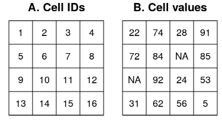

```{r setup, include=FALSE}
knitr::opts_chunk$set(echo = TRUE)
```
# What is spatial data?
- In simple terms, spatial data refers to data about geographical locations (e.g. latitude and longitude).
- More specifically, is the data where the associated locations *matter* for the purposes of what we want to do.
- Very often we distinguish between the geographic locations themselves (the "geometry" or "shape") and the data associated to that geometry ("attributes").

What would be the geometry and attributes of data collected during a bottom trawl?
```{r out.width = "50%", echo= FALSE}

```

# Geographic information systems (GIS)
Typically when we think about analysing spatial data we think about Geographic Information Systems (GIS).

GIS are specialised sofware for the management, analysis and display of spatial data.  The big player here is ArcGIS, which is widely used, but is proprietary (and very costly): http://www.esri.com/arcgis/about-arcgis.

Now, thanks to free and open source software for geospatial (FOSS4G) analysis we can have easy access to powerful tools.  For example, there are excellent open source GIS, including QGIS (http://www.qgis.org/en/site/) and GRASS (https://grass.osgeo.org/).

In general, GIS are used through graphical interfaces (GUIs), which discourages reproducibility (although GIS functions can be accessed from the command line.)


# Using R for spatial analysis and mapping
In recent years, R has been gaining strength as a full-fledge tool for the analysis of spatial data:
  - Development of classes for spatial data
  - Inteaction with GIS (Geographic Information System).
  - Interaccion with geographical databases.

Now R has much of the functionality that was available previously only on GIS software:
  - Read, manipulate and save spatial data.
  - Perform operations with spatial data like a GIS: selections, overlays, clipping and making buffers.
  - Sophisticated statistical methods (e.g. geographically weighted regression, spatial interaction models) can be built around your spatial data.


# Spatial data models

Spatial phenomena can be thought in two basic ways:

1) As discrete objects or events with clear boundaries.  Examples: locations of cities, rivers, national boundaries.

2) As continuous properties without clear boundaries.  Examples: bottom depth, temperature.

These two types take us to two distinct data models:

## Vector data model
- The main vector data types are points, lines and polygons (there are others).
- In all cases, the geometry consists of sets of coordinate pairs.


### Points
- Points are the simplest case of vector data.
- Each point has a set of coordinate values and may include other attributes.
- Multiple points can be considered as a single geometry (sometimes called multipoints) that could be associated to a single set of attributes.

<center>
{width=25%}
</center>

### Lines
- Lines are sets of points connected by straight segments.
- Lines are similar to multipoints, but with a particular *order*.  We need to know which point should be connected.
- We can have multilines, mulitple lines forming a single geometry (e.g. a river system).

<center>
{width=25%}
</center>

- Networks are a special class of line geometry where information is stored about the links between the nodes, for example direction or traffic.  We will not deal with these.


### Polygons
- Polygons refers to a line in which the last coordinate pair coincides with the first one.
- Polygons can have holes: smaller polygons that remove parts of the enclosing polygons (e.g. an island within a lake).
- Valid polygons do not self-intersect.
- Again, we can have multipolygons: multiple polygons that form a single geometry (e.g. a single country with many islands).

<center>
{width=25%}
</center>

## Raster data model

Raster data is used to represent parameters that vary continuously in space.

A raster represents some area as a regular grid of equally sized rectangles, known as cells or pixels.
Each cell can hold one or more data values (i.e. single-layer and multi-layer rasters).  Data can be continuous (e.g. depth, temperature) or discrete/categorical (e.g. land types)

<center>
{width=50%}
</center>


Each cell has an individual ID.  The raster does not stores the coordinates (corners) of individual cells.  Instead, is implicitly set by knowing the spatial extent of the raster (i.e. its size), the resolution (cell size), and the origin (the coordinates of the first corner).


<center>
{width=50%}
</center>


Continuous data can be stored in other ways, for example in triangulated irregular networks (TINs).  We will not deal with these in this course.


# The ecosystem of packages for spatial data in R.
As we know, the capabilities of R are extended through the use of *packages*.  In R there are two main groups of ecosystems of packages to deal with spatial data:

## The old ecosystem

In the old days (early 2000's) several R had several packages for the analysis of spatial data, including *akima* for interpolation, and *spatstat* for point pattern analysis.  These packages did not have a uniform way to represent spatial data in R.  For example the **geoR** package defined the class *geodata*, which is a list with objects named *coords* and *data*, while the **gstat** package defined the class *gstat*, a list with objects named *data*, *model* and *set*.  Things were messy.

In 2005, the **sp** package was created to unify the treatment of spatial data in R and to

  - provide classes for vector spatial data: **SpatialPoint**, **SpatialLine**, **SpatialPolygon**, etc.
  - provide (limited) support for raster data: **SpatialPixel**, **SpatialGrid**
  - share methods (e.g. *plot*, *summary*)
  - provide conversions to other representations (one-to-many, many-to-one).

In addition to **sp**, the package **rgdal** (released in 2003) was used to read/write spatial data (using the powerful GDAL libraries, https://gdal.org/), and the package **rgeos** (released in 2010) was used to perform spatial operations (using the GEOS library, https://trac.osgeo.org/geos).  Transformation of geographic projections are done use the external library PROJ (https://proj.org/).

In parallel, the package **raster** was released in 2010 to provide better support for raster data.

The **sp/rgdal/rgeos/raster** ecosystem made R a powerful tool for spatial analysis.  Today more than 500 R packages rely on **sp**.

# The new framework: the sf package

Recently a new package ecosystem was developed for the analysis of spatial data in R.  It is centred around the *sf* package (sf = "simple features"), first released in 2016.

The **sf** package provides a new class for vector spatial data, essentially replacing **sp**.

It also has functions to read/write data, and to do operations on vector data.  So it also replaces the **rgdal** and **rgeos** packages.

The **sf** package has a more modern data structure (more on this later), and also works well with packages of the "tidyverse".

The very new **stars** package (released in 2018) provides datacubes and rasters.

The package **terra** is being developed as a replacement of **raster**
