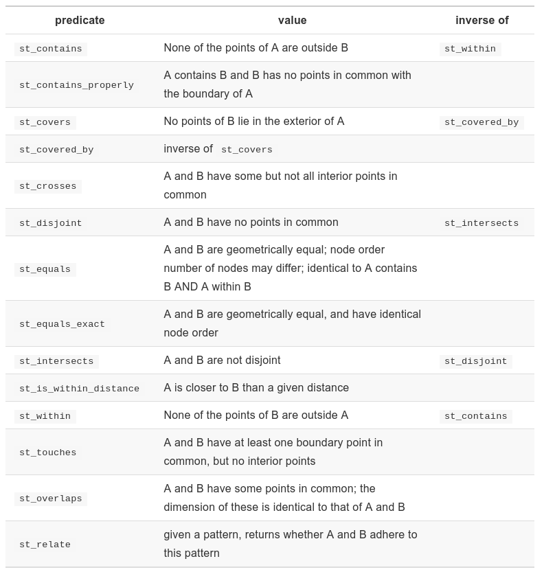

```{r, include=FALSE}
knitr::opts_chunk$set(echo = TRUE)
```
#### These are the packages needed for this tutorial:
```{r setup}
library(tidyverse)
library(sf)
library(units)
```

#### Nephrops data
First, lets load some data.  The files datras_2018_haul.csv and datras_2018_length.csv contain data from ICES's DATRAS (the Database of Trawl Surveys) from 2018. We will create an sf object with the total number of *Nephrops* sampled per tow.

```{r message=FALSE }

# Load nephrops data from ICES
## get station data
survey <- read_csv("ftp://ftp.hafro.is/pub/data/csv/datras_2018_haul.csv",
                   guess_max = 2000) %>%
  filter(year == 2018) %>%
  select(id,
         survey,
         lat = shootlat, # Get starting point
         lon = shootlong)

## get length data
nephrops <- read_csv("ftp://ftp.hafro.is/pub/data/csv/datras_2018_length.csv") %>%
  filter(latin == "Nephrops norvegicus") %>%
  left_join(survey, by = "id") %>%
  group_by(id) %>%
  summarise(survey = first(survey),
            lat = first(lat),
            lon = first(lon),
            num = sum(n)) %>%
  ungroup()

head(nephrops)

```
Next, let's convert it into an sf object so we can do spatial operations.

```{r }
nephrops <- nephrops %>%
  st_as_sf(coords = c("lon", "lat"), crs = 4326)

class(nephrops)

```
Note that we need to specify which columns have the x and y coordinates (always list the x coordinate first), and the coordinate reference system (CRS).  The number 4326 is the ESPG code for unprojected data using the WSG84 datum.  Use this CRS for latitude and longitude data, unless you know the data has some other CRS.

Now, let's load the Nephrops functional units.  These are spatial regions used for assessment and reporting.

```{r }
nfu <- read_sf("ftp://ftp.hafro.is/pub/data/shapes/nephrops_fu.gpkg")


```
Note that the CRS in the *nfu* object is **the same** as in the *np* object.  This is a fundamental requirement.  If we want to do spatial operations between two datasets, they need to be in the same coordinate system.

Let's take a look at both objects:

```{r }

ggplot() +
  geom_sf(data = nfu, aes(fill = name), alpha = 0.5) +
  geom_sf(data = nephrops, size = 0.3)

```
## About binary predicates
Binary predicates are operations that *test* the topological relationship between two geometries, resulting in a TRUE or FALSE for every combination of features in the two *sf* objects used as input.

The **sf** package provides a family of functions to implement several binary predicates:

```{r out.width = "100%", echo= FALSE}


```

Each function tests a relationship between the interior, boundary or exterior of one object with one of the same attributes of the other object.  This is based on what is known as the Dimensionally Extended nine-Intersection Model (DE-9IM).

```{r out.width = "100%", echo= FALSE}
knitr::include_graphics("./img/de9im.png")
```

The functions can return either a sparse index list (class `sgbp`), or if we use the 'sparse = FALSE' argument, we obtain a logical matrix.

Let's find out in which Nephrops functional unit are located the records in the nephrops data:

```{r message=FALSE}
test1 <- st_within(nephrops, nfu)
class(test1)
test1

test2 <- st_within(nephrops, nfu, sparse = FALSE)
class(test2)
dim(test2)

test2[1, ]


```
As you can see, in both ways we find out that for example the first record in the Nephrops data is located in the 25th functional unit (which is the Kattegat).


If we use the `sparse = FALSE` argument, we can combine the binary predicate functions with `filter()` to filter records according to the spatial relation with another spatial object.


## Spatial subsetting and binary predicates
As a reminder, we can subset data frames (and sf objects) by using a logical vector, or an expression that generates a logical vector.  For example

```{r }
nephrops_bits <- nephrops[nephrops$survey == "BITS", ]

```

Or using the tidiverse

```{r }
nephrops_bits <- nephrops %>%
  filter(survey == "BITS")

```
In a similar way, we can subset a sf object by asking if they relate or not in some way to another sf object.  In other words, we can do a spatial subsetting.


```{r message=FALSE}

nfu_kattegat<- nfu %>% filter(name == "Kattegat")

# Within the Kattegat
nephrops_kattegat <- nephrops %>%
  filter(st_within(x = ., y = nfu_kattegat, sparse = FALSE))

ggplot() +
  geom_sf(data = nfu, aes(fill = name), alpha = 0.5) +
  geom_sf(data = nephrops_kattegat, size = 0.3) +
  theme(legend.position = "none")


# Outside the Kattegat
nephrops_no_kattegat <- nephrops %>%
  filter(st_disjoint(x = ., y = nfu_kattegat, sparse = FALSE))

ggplot() +
  geom_sf(data = nfu, aes(fill = name), alpha = 0.5) +
  geom_sf(data = nephrops_no_kattegat, size = 0.3) +
  theme(legend.position = "none")

# At least 200 km from Kattegat
distance <- set_units(200, km)

nephrops_near_kattegat <- nephrops %>%
  filter(st_is_within_distance(x = ., y = nfu_kattegat, sparse = FALSE, dist = distance))


ggplot() +
  geom_sf(data = nfu, aes(fill = name), alpha = 0.5) +
  geom_sf(data = nephrops_near_kattegat, size = 0.3) +
  theme(legend.position = "none")

```


## Spatial (and non-spatial) joins

We can join two sf objects based on areas of shared geographic space (spatial join, as opposed to shared variables as in non-spatial joins).  For this, we use the `st_join` function.

```{r }

nephrops <- nephrops %>%
  st_join(nfu %>% select(nfu = name),
          join = st_intersects)

ggplot() +
  geom_sf(data = nephrops, aes(color = nfu), size = 0.3) +
  theme(legend.position = "none")

```
And an example with two sets of polygons:

```{r }
ier <- read_sf("ftp://ftp.hafro.is/pub/data/shapes/ices_ecoregions.gpkg") %>%
  select(ecoregion)  # 17 polygons

ospar <- read_sf("ftp://ftp.hafro.is/pub/data/shapes/ospar.gpkg") %>%
  select(subregion)  # 50 polygons

ospar_ier <- st_join(ospar, ier) %>%
  mutate(label = str_c(subregion,"-", ecoregion))

ggplot() +
  geom_sf(data = ospar, col = "red", fill = NA) +
  geom_sf(data = ier, col = "blue", fill = NA)

ospar_ier <- st_join(ospar, ier) %>%
  mutate(label = str_c(subregion,"-", ecoregion)) # 92 polygons!!!

ggplot() +
  geom_sf(data = ospar_ier, aes(fill = subregion))

ggplot() +
  geom_sf(data = ospar_ier, aes(fill = ecoregion))

ospar_ier <- st_join(ospar, ier, largest = TRUE) # 50 polygons


```

The default predicate in the *st_join()* function is *st_intersects*.  But others could be used, included:

st_contains_properly

st_contains

st_covered_by

st_covers

st_crosses

st_disjoint

st_equals_exact

st_equals

st_is_within_distance

st_nearest_feature

st_overlaps

st_touches

st_within

Note the warning *although coordinates are longitude/latitude, st_intersects assumes that they are planar*.  This is because the polygons are **not** in a coordinate projected system.


## Counting
Number of Nephrops records per nfu

```{r }

nephrops_count <- nephrops %>%
  st_join(nfu) %>%
  count(name)

nephrops_count

```
Note that the result of this is another *sf* object, with geometry type MULTIPOINT.
