```{r, echo = FALSE}
library(knitr)
library(grid)
knitr::opts_chunk$set(warning = FALSE,
                      message = FALSE)

#knitr::opts_chunk$set(out.width = '750px', dpi = 200)
```

```{r, echo = FALSE}
cl = function(x, color = "blue"){
  outputFormat = knitr::opts_knit$get("rmarkdown.pandoc.to")
  if(outputFormat == 'latex')
    paste("\\textcolor{",color,"}{", x ,"}",sep="")
  else if(outputFormat == 'html')
    paste("<font color='",color,"'>", x ,"</font>",sep="")
  else
    x
}
```


```{r, width = 150, echo = FALSE}
include_graphics("img/data_science.png")
```

# Preamble
___


```{r echo=FALSE}
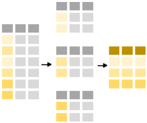
```

Commonly, when collating summaries by group, one wants to:

* **Split** up a big data structure into homogeneous pieces,
* **Apply** a function to each piece
* **Combine** all the results back together.

For example, one might want to:

* Calculate summary statistics for each category (read: group)
* Perform group-wise transformations (read: apply) like summary or re-scaling/standardization
* Fit the same model to different subset of the data

The tidyverse package, through the dplyr, comes to the rescue.

* Similar to ggplot2 they feature a Domain Specific Language (DSL) specially designed for data summaries.
* Developed by Hadley Wickam, the creator ggplot2 and other useful tools.

Essentially dplyr offer a collection of simple but powerful commands (or verbs) that facilitate this split-apply-combined process:

* **filter**: keep rows matching criteria
* **select**: pick columns by name
* **arrange**: order the rows according to a variable
* **mutate**: add new variables
* **summarise**: reduce variables to values
* **group_by**: gives the group to apply the analysis functions to 

The structure of these commands is always the same:

* **First argument to the function is a data frame**
* Subsequent arguments say what to do with data frame
* Always return a data frame
    * this is the **key** difference of the tidyverse vs. base R approach
* It recognizes the columns of the data.frame as variables, that is only need to write `col.name` instead of `dat$col.name`

#### Reading material 

* [R for Data Science](http://r4ds.had.co.nz/transform.html)
* [Data Transformation Cheat Sheet](https://github.com/rstudio/cheatsheets/raw/master/data-transformation.pdf)


# Manipulate Cases
___

** Import data used**:
```{r}
library(tidyverse)
d <- 
  read_csv("ftp://ftp.hafro.is/pub/data/csv/minke.csv")
```

## **filter**: Extract rows


```{r echo = FALSE}
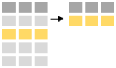
```

One can extract rows that meet logical criteria by using the `r cl("filter")` command. The first argument is the name of the data frame with subsequent argument(s) being logical expressions. E.g. one subsets the minke data containing only year 2004 by:

```{r}
filter(d, year == 2004)
```

Same as:
```{r, eval = FALSE}
filter(d, year %in% 2004)
```

Only data from 2004 and onwards:

```{r}
filter(d, year >= 2004)
```

Using subsequent arguments one can refine the subset further:
```{r, eval = FALSE}
filter(d, year >= 2004 & year < 2006)
filter(d, year >= 2004, year < 2006)     # same as above
filter(d, between(2004, 2005))           # same as above
```


All but the year 2004 would be:
```{r, eval = FALSE}
filter(d, year != 2004)
```

But this would give year 2005 to 2007:
```{r, eval = FALSE}
filter(d, year %in% 2005:2007)
```

Which would be the same as:
```{r, eval = FALSE}
filter(d, !year %in% 2003:2004)
```

Filter takes any logical statement:
```{r, eval = FALSE}
 x == a   # x is equal to a
 x %in% a # x is "within" a
 x != a   # x is not equal to a
 x > a    # x is greater than a
 x >= a   # x is greater or equal to a
 x < a    # x is less than a
 x <= a   # x is less or equal to a
 a & b    # a and b
 a | b    # a or b
 is.na(x) # is a equal to NA (missing)
 ...      # ...
```


The arguments can operate on different variables. E.g. to extract mature males caught in 2007 one would write:

```{r, eval = FALSE}
filter(d, maturity == "mature", sex == "Male", year == 2007)
```

NOTE: A "comma" is recognized as "AND". If one were to specify "OR" use the "|":

```{r, eval = FALSE}
filter(d, maturity == "mature" | sex == "Male" | year == 2007)
```

<div class="panel panel-warning">
<div class="panel-heading">Exercise</div>
<div class="panel-body">

* Find all males caught in the northern area in 2006 and 2007
* Find all males that are either immature or pregnant
* Find all whales caught that did not have a maturity status determined
* Find all whales that were caught in year 2007 or were mature males

```{r, echo = FALSE, eval = FALSE}
filter(d, sex == "Male", area == "North")
filter(d, sex == "Male" & maturity %in% c("immature", "pregnant")) 
filter(d, is.na(maturity))
filter(d, year == 2007 | (maturity == "mature" & sex == "Male"))
```

</div>
</div>

## **select**: Extract columns

```{r echo = FALSE}
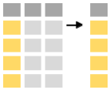
```

The `r cl("select")` functions allows you to extract certain columns:
```{r}
select(d, id, year, maturity)
```

You can also omit certain columns using negative indexing: for example you can select all columns except `length`:
```{r}
select(d, -length)
```

A combination of variables to drop could be written as:
```{r, eval = FALSE}
select(d, -c(weight, maturity))
```

The `r cl("select")` function has some useful helper function:

```{r, eval=FALSE}
starts_with('stomach')  # Finds all columns that start with "stomach"
ends_with('weight')     # Finds all columns that end with "weight"
id:age                  # Finds all columns between "id" and "age"
contains('mach')        # Finds all columns that contain "mach"
-date                   # Remove column "date" from the dataset
```

And you can of course combine these at will:
```{r}
select(d, id:length, starts_with('stomach'))
```

`r cl("select")` also allows you to rename columns as you select them:
```{r}
select(d, id, yr = year)
```

but this only selects the requested columns, others are dropped.

## **rename**: Rename columns

```{r echo = FALSE}
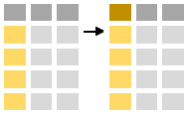
```


If you just want to rename a couple of columns in the data frame leaving the other columns intact you can use the function `r cl("rename")`:

```{r}
rename(d, time = date)
```


<div class="panel panel-warning">
<div class="panel-heading">Exercise</div>
<div class="panel-body">

* Select age, length and id from the minke dataset, and rename id to "whale_id"
* Select the id column and all columns that contain the text "weight".

</div>
</div>

## **arrange**: Order rows

```{r echo=FALSE}
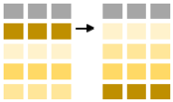
```


To sort the data we employ the `r cl("arrange")`-function. Sorting by length is as follows (in ascending order):

```{r}
arrange(d, length)
```

and in descending order:
```{r}
arrange(d, desc(length))
```

You can also arrange by more that one column:
```{r}
arrange(d, sex, desc(length))
```

## **mutate**: Compute new column

```{r echo=FALSE}
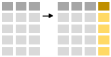
```

`r cl("mutate")` allows you to add new columns to your data. Let's calculate the approximate weight:

```{r}
d2 <- select(d, id, length, weight)
mutate(d2, computed_weight = 0.00001 * length^3)
```

You can also do more than one "mutation":
```{r}
mutate(d2,
       computed_weight = 0.00001 * length^3,
       approx_weight = ifelse(is.na(weight), 0.00001 * length^3, weight))
```

To make our lives a bit easier `r cl("mutate")` "remembers" earlier transformations within the sequence:

```{r, eval = FALSE}
mutate(d2,
       computed_weight = 0.00001 * length^3,
       approx_weight = ifelse(is.na(weight), computed_weight, weight))
```

<div class="panel panel-warning">
<div class="panel-heading">Exercise</div>
<div class="panel-body">

* Add a column to the minke whale dataset where Fullton's condition factor, $K=100.000(W/L^3)$, is calculated

</div>
</div>

# Summarise cases

## **summarise**:

```{r echo=FALSE}
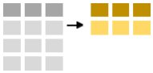
```

To summarise data one uses the  `r cl("summarise")`-function. Below we calculate the number of observations (using the `cl("n")`-function and the mean minke length.

```{r}
summarise(d,
          n.obs = n(),
          ml = mean(length, na.rm = TRUE))
```

## **group_by**:

```{r echo=FALSE}
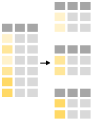
```

The power of the command `r cl("summarise")` is revealed when used in conjunction with `r cl("group_by")`-function. The latter functions splits the data into groups based on one or multiple variables. E.g. one can split the minke table by maturity:

```{r}
by_maturity <- 
  group_by(d, maturity)
by_maturity
```

The table appears "intact" because it still has 190 observations but it has 6 groups, representing the different values of the maturity scaling in the data (anoestrous, immature, mature, pregnant, pubertal and "NA").

The `r cl("summarise")`-command respects the grouping, as shown if one uses the same command as used above, but now on a dataframe that has been grouped:
```{r}
summarise(by_maturity,
          n.obs = n(),
          mean = mean(length, na.rm = TRUE))
```


<div class="panel panel-warning">
<div class="panel-heading">Exercise</div>
<div class="panel-body">

* Calculate the minimum, median, mean, standard deviation and standard error of whale lengths in each year

</div>
</div>

# Combining verbs
___

In R one can apply functions to data repeatedly:
```{r}
summarise(group_by(d, sex, year), obs = n())
```

All this quickly becomes cumbersome and hard to read, for example what does this do?

```{r,eval=FALSE}
arrange(summarise(group_by(d, sex, year), obs = n()), desc(obs))
```

## The `%>%` operator

dplyr allows chaining of operators using the `%>%` operator - often referred to as the pipe operator. The above code then becomes:

```{r}
d %>% 
  group_by(sex, year) %>% 
  summarise(obs = n()) %>% 
  arrange(desc(obs))
```

This needs a bit of explaining. Noticed that the first argument in each function is missing. Instead of calling a function with `f(x,y)` you can do `x %>% f(y)`, that is "take x, then apply f with a setting y". This essentially means that `%>%` operator takes the stuff on the left and places it as the **first** argument to function on the right hand side. This get infinitely more useful when you start creating longer chains: 

```{r}
d %>%
  # note - here overwrite the weight column:
  mutate(weight  = ifelse(!is.na(weight), weight, 0.00001 * length^3),
         K = 100 * weight * 1000 / length^3) %>% 
  group_by(sex, year) %>% 
  summarise(n=n(),
            ml = mean(length),
            sl = sd(length),
            mK = mean(K),
            sK = sd(K)) %>% 
  arrange(year)
```

Recomended that you "read" the `%>%` as **"then"**. Hence the above can be read as:

1. take data d
2. then calculate the weight if missing and K
2. then split into groups by sex and year
3. then calculate the mean and standard deviation of length and K for each group
4. then arrange by year

Note that Rstudio has a built in shortcut for the `%>%` operator, [ctrl] + [shift] + M.


<div class="panel panel-warning">
<div class="panel-heading">Exercise</div>
<div class="panel-body">


* How do you produce this table, the statistics being based on length?:
```{r, echo = FALSE}
read_csv("ftp://ftp.hafro.is/pub/data/csv/minke.csv") %>% 
  group_by(sex, area) %>% 
  summarise(standard.error = sd(length) / sqrt(n()))
```

</div>
</div>

# Tidy dataframes

The defintion of a tidy dataset: Each column is a variable, and each row is an observation. The SMB dataset (ftp://ftp.hafro.is/pub/data/csv/is_smb.csv) is an example of an untidy dataset. Lets take a look:

```{r}
smb <- 
  read_csv("ftp://ftp.hafro.is/pub/data/csv/is_smb.csv")
glimpse(smb)
```

**Can you identify columns that should actually be a observations**?

## pivot_longer

To make a table longer, we can employ the `r cl("pivot_longer")`-function. Lets just take the biological variables:

```{r}
wide <- 
  smb %>% 
  select(id, cod_kg:monkfish_n)
long <- 
  wide %>% 
  # select just the abundance variables
  select(id, ends_with("_n")) %>% 
  pivot_longer(cols = -id, names_to = "species", values_to = "n") %>% 
  mutate(species = str_remove(species, "_n"))
glimpse(long)
```

So we have moved from a dataframe that was 19846 rows with 7 variables to a dataframe of 119076 (19846 stations x 6 species) rows with only 3 variables:

* **id**: Station id
* **species**: Species name
* **n**: Abundance (standardized to 4 nautical miles)

This latter (longer) format is the proper format for efficient computer programming. The following exercise should illustrate that.

<div class="panel panel-warning">
<div class="panel-heading">Exercise</div>
<div class="panel-body">


1. Use the wide-dataframe above and write a code to calculate the median abundance (***_n column) for each species
2. Use the long-dataframe above and write a code to calculate the median abundance for each species

```{r, echo = FALSE}
wide %>% 
  summarise(cod = median(cod_n),
            haddock = median(haddock_n),
            saithe = median(saithe_n),
            wolfish = median(wolffish_n),
            plaice = median(plaice_n),
            monkfish = median(monkfish_n))
long %>% 
  group_by(species) %>% 
  summarise(median = median(n))
```

</div>
</div>

## pivot_wider

When reconstructing untidy tables we sometimes may need to make a long table wider again. In the above example we only made a long table for abundance (n). We could modify the above code for the biomass (kg). Doing all in one step requires the use of `r cl("pivot_wider")`, the steps being:

1. Make a table containing id, current variable (cod_n, cod_kg, ...) and the corresponding value (abundance or biomass)
2. Separate the value measured (kg or n) from the species name
3. Generate separate columns for abundance (n) and biomass (kg)

```{r}
long <-
  wide %>% 
  # step 1
  pivot_longer(-id) %>%
  # step 2
  separate(name, sep = "_", into = c("species", "variable")) %>% 
  # step 3
  pivot_wider(names_from = variable)
```

# Combine variables (join)
___

Normally the data we are interested in working with do **not** reside in one table. E.g. for a typical groundfish survey data one stores the station table separate from the biological table. Lets read in the SMB tables in such a format:

```{r}
station <- 
  read_csv("ftp://ftp.hafro.is/pub/data/csv/is_smb_stations.csv")
biological <- 
  read_csv("ftp://ftp.hafro.is/pub/data/csv/is_smb_biological.csv")
station %>% select(id:lat1) %>%  arrange(id) %>% glimpse()
biological %>% arrange(id) %>% glimpse() 
```

Here the information on the station, such as date, geographical location are kept separate from the detail measurments that are performed at each station (weight and numbers by species. The records in the station table are unique (i.e. each station information only appear once) while we can have more than one species measured at each station. Take note here that the biological table does not contain records of species that were not observed at that station. The link between the two tables, in this case, is the variable id.

## **left_join**: Matching values from y to x

```{r echo = FALSE}
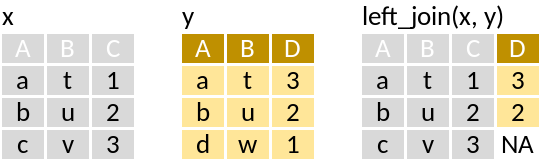
```

Lets say we were interested in combining the geographical position and the species records from one station:

```{r}
station %>% 
  select(id, date, lon1, lat1) %>% 
  filter(id == 29654) %>% 
  left_join(biological)
```

Take note here:
* The joining is by common variable name in the two tables (here id)
* That we only have records of fours species in this table, i.e. a value of zero for a species is not stored in the data.

## **right_join**: Matching values from x to y

```{r echo = FALSE}
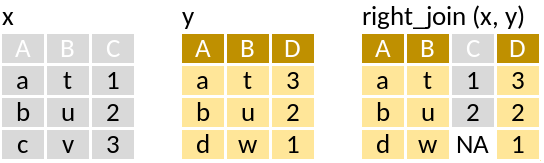
```

This is really the inverse of left_join.

## **inner_join**: Retain only rows with matches

```{r echo = FALSE}
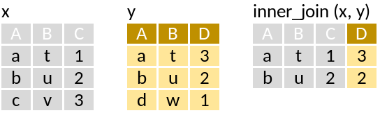
```

Example of only joining station information with monkfish, were monkfish was recorded:

```{r}
station %>% 
  inner_join(biological %>% 
               filter(species == "monkfish"))
```

## **full_join**: Retain all rows

```{r echo = FALSE}
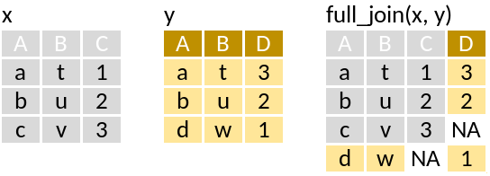
```

```{r}
station %>% 
  full_join(biological %>% 
               filter(species == "monkfish")) %>% 
  select(id, species:n)
```

Here all the stations records are retained irrepsective if monkfish was caught or not.

<div class="panel panel-warning">
<div class="panel-heading">Exercise 1</div>
<div class="panel-body">

Run through this set of code that supposedly mimics the pictograms above:

```{r, eval = FALSE}
x <- data_frame(A = c("a", "b", "c"),
                B = c("t", "u", "v"),
                C = c(1, 2, 3))
y <- data_frame(A = c("a", "b", "d"),
                B = c("t", "u", "w"),
                D = c(3, 2, 1))

left_join(x, y)
right_join(x, y)
left_join(y, x)
inner_join(x, y)
full_join(x, y)
```
</div>
</div>

# Combine cases (bind)
___


## **bind_rows**: One on top of the other as a single table.

```{r echo = FALSE}
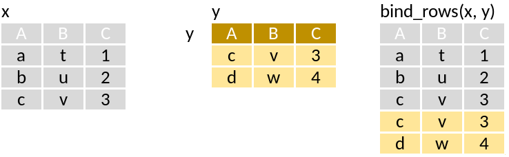
```

## **union**: Rows in x **or** y

```{r echo = FALSE}
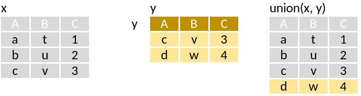
```

## **intersect**: Rows in x **and** y.

```{r echo = FALSE}
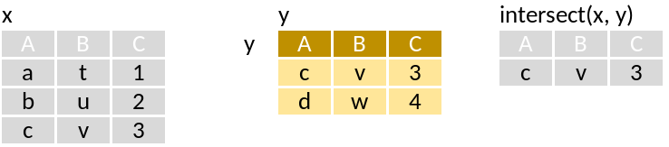
```

## **setdiff**: Rows in x but not y

```{r echo = FALSE}
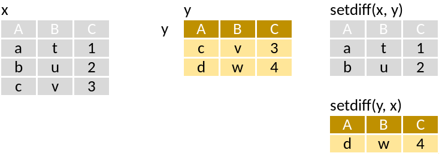
```

<div class="panel panel-warning">
<div class="panel-heading">Exercise 2</div>
<div class="panel-body">

Run through this set of code that supposedly mimics the pictograms above:

```{r, eval = FALSE}
y <- data_frame(A = c("c", "d"),
                B = c("v", "w"),
                C = c(3, 4))
bind_rows(x, y)
union(x, y)
intersect(x, y)
setdiff(x, y)
setdiff(y, x)
```

</div>
</div>

